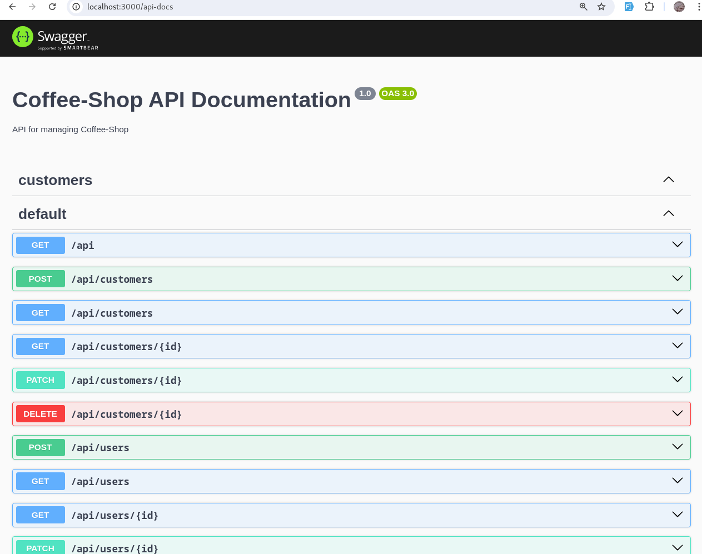

# Coffee-Shop API ☕

Welcome to the Coffee-Shop API! This project provides an API for managing data for a coffee shop.

## Requirements

- Node.js (version 18 or higher) 🟢
- Docker (version 25 or higher) 🐳
- Docker Compose (for managing the containers) 📦

## Database Diagram


<div style="display: flex; flex-wrap: wrap; gap: 10px; justify-content: center;">
    

</div>


## Getting Started

Follow these steps to set up and run the project:

1. **Clone the repository** 🧩

   ```bash
   git clone <repository-url>
   cd <directory-name>
   ```

2. Copy the environment variables ⚙️

```bash
cp .env.example .env
```

3. Install dependencies 📦

```bash
npm install
```

4. Start the Docker containers 🚢

Ensure Docker is running, then start the database container.

```bash
docker compose up
```

5. Run the development server 🚀

Start the application in development mode.

```bash
npm run start:dev
```

6. Run database migrations 🗃️

Apply the latest database migrations.

```bash
npm run migrate:fresh
```


### Usage

The API is now running at: http://localhost:3000.

You can access docs at: http://localhost:3000/api-docs

<div style="display: flex; flex-wrap: wrap; gap: 10px; justify-content: center;">
    
</div>